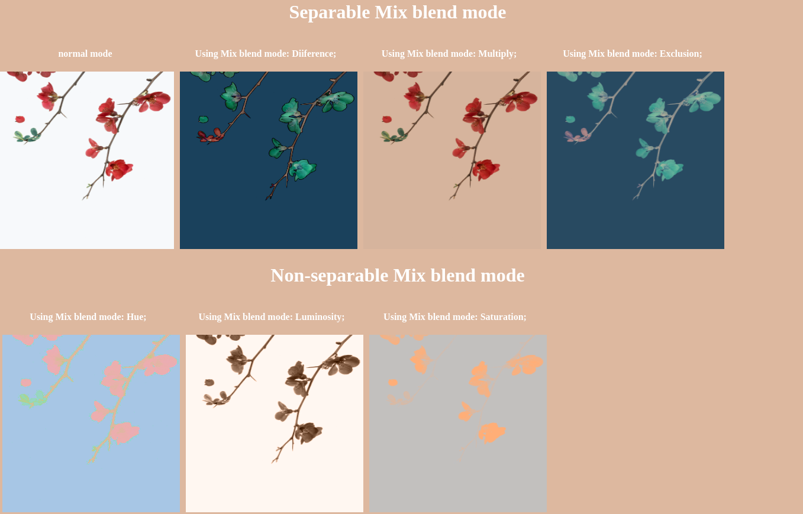
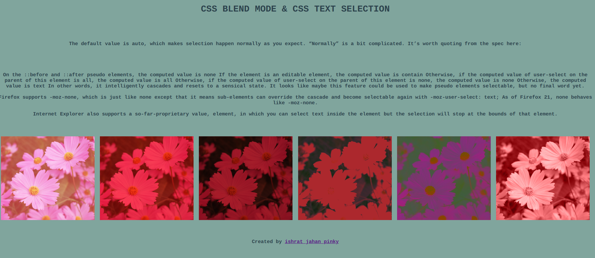
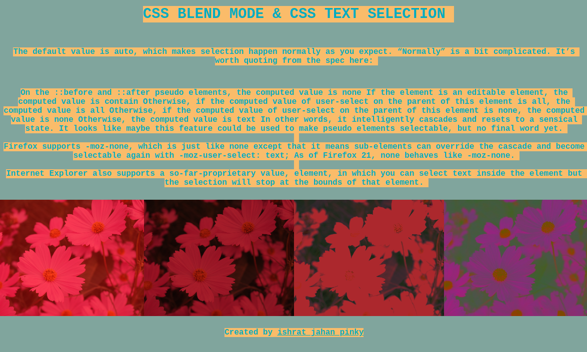

# Css-Tips-and-tricks

### Css blend mode 
#### <a href="https://github.com/Pinky057/Css-Tips-and-tricks/tree/Css-blend-mode">GitHub Code</a>
#### <a href="https://www.youtube.com/watch?v=SSWrvKw8-BY">Youtube link</a>
#### <a href="https://codepen.io/Ishrat_Pinky/pen/yLjwjxg">CodePen link</a>

### Css mix blend mode

#### <a href="https://github.com/Pinky057/Css-Tips-and-tricks/tree/CSS-mix-blend-mode">GitHub Code</a>
#### <a href="https://www.youtube.com/watch?v=SSWrvKw8-BY">Youtube link</a>
#### <a href="https://codepen.io/Ishrat_Pinky/pen/yLjwjxg">CodePen link</a>

### Css mix blend mode With Toogle Button
#### <a href="https://github.com/Pinky057/Css-Tips-and-tricks/tree/CSS-mix-blend-mode">GitHub Code</a>
#### <a href="https://www.youtube.com/watch?v=SSWrvKw8-BY">Youtube link</a>
#### <a href="https://codepen.io/Ishrat_Pinky/pen/yLjwjxg">CodePen link</a>

### Css Text Selection

#### <a href="https://github.com/Pinky057/Css-Tips-and-tricks/tree/Css-Text-Selection">GitHub Code</a>
#### <a href="https://www.youtube.com/watch?v=SSWrvKw8-BY">Youtube link</a>
#### <a href="https://codepen.io/Ishrat_Pinky/pen/yLjwjxg">CodePen link</a>

